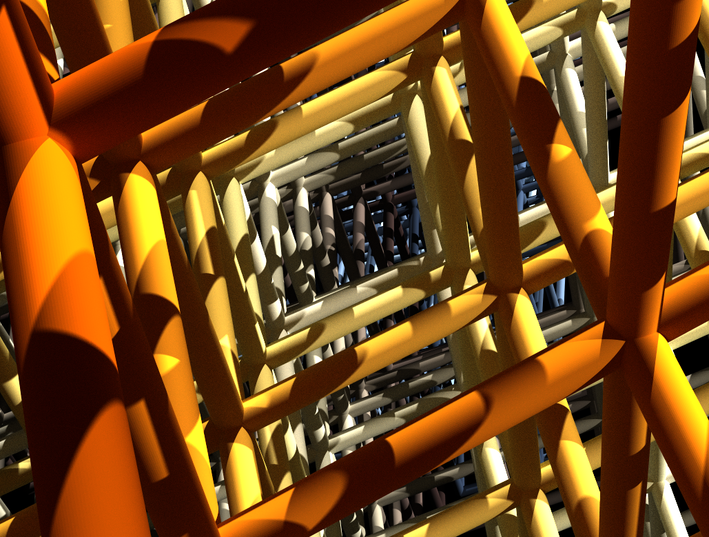

<p align="center"></p>

# Inverting the structury-property map of truss metamaterials via deep learning

We introduce a framework to inversely design truss metamaterials with a given anisotropic elasticity as described in ['Inverting the structure-property map of truss metamaterials via deep learning'](https://www.pnas.org/content/119/1/e2111505119).

To start with the inverse design, simply clone this repository via
```
git clone https://github.com/jhbastek/InvertibleTrussDesign.git
```
and run the corresponding script:

- `main_train.py` trains the presented framework with lattice-stiffness pairs computed using an inhouse finite element simulation. **It should only be used if one is interested to retrain the networks**, e.g., to reproduce the evaluation presented in the publication. The training dataset can be found under this [link](https://www.research-collection.ethz.ch/handle/20.500.11850/520254).
- `main_predict.py` predicts and stores a variety of inverse designs given a certain set of anistropic stiffness tensors. These tensors must be provided in Voigt notation via a .csv-file in 'data/prediction.csv', as, e.g., the provided anisotropic bone samples which can be run to reproduce the presented results. (Note that the predicted stiffnesses slightly differ from the ones presented in the publication, which were computed and verified using our inhouse finite element framework.)
- `main_export.py` should only be executed after main_predict.py. It plots the predicted lattice descriptor and converts it into a list of nodal position and connectivities for further postprocessing. Additionally, it warns the user if the requested stiffness is to stiff or soft for the considered range of relative densities and Young's modulus, in which case main_predict.py should be rerun with a suitable Young's modulus of the base material.

For further information, please first refer to the [publication](https://www.pnas.org/content/119/1/e2111505119), [supporting information](https://www.pnas.org/doi/10.1073/pnas.2111505119#supplementary-materials), or reach out to [Jan-Hendrik Bastek](mailto:jbastek@ethz.ch).

## Requirements

- Python (tested on version 3.7.1)
- Python packages:
  - Pytorch (tested on CUDA version 11.4)
  - Pandas
  - NumPy
  - Plotly (used to plot the inversely designed structures)

## Citation

If this code is useful for your research, please cite our [publication](https://www.pnas.org/content/119/1/e2111505119).
```bibtex
@article{Bastek2022,
author = {Bastek, Jan-Hendrik and Kumar, Siddhant and Telgen, Bastian and Glaesener, Rapha{\"{e}}l N and Kochmann, Dennis M},
doi = {10.1073/pnas.2111505119},
issn = {0027-8424},
journal = {Proceedings of the National Academy of Sciences},
month = {jan},
number = {1},
pages = {e2111505119},
title = {{Inverting the structure–property map of truss metamaterials by deep learning}},
url = {http://www.pnas.org/lookup/doi/10.1073/pnas.2111505119},
volume = {119},
year = {2022}
}
```
